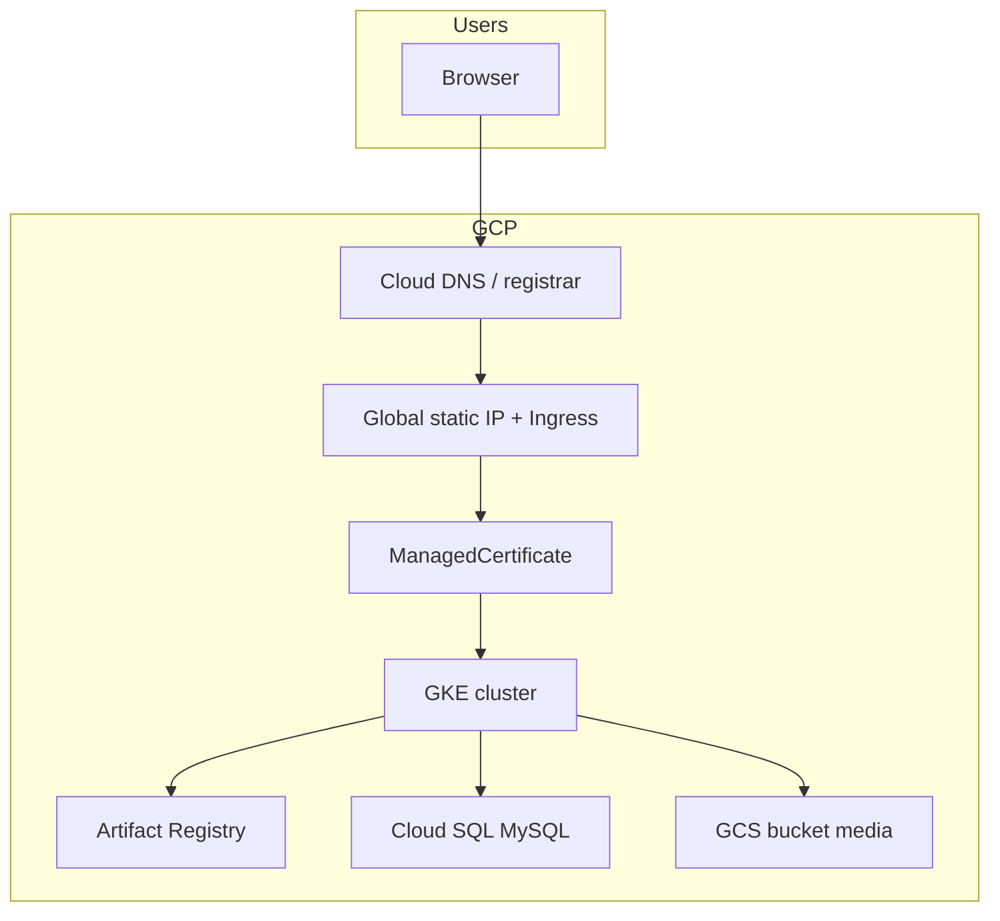

# Deployment overview (Crowd & Cult on GCP)

This document describes the **production-style** setup we implemented: GKE, Artifact Registry, Cloud SQL (MySQL), private GCS media, Workload Identity, and managed TLS. Use it with the **per-repo** manuals when you build, change env vars, or clone a new environment (e.g. staging).

## Architecture (high level)

- **Ingress** terminates HTTPS and routes:
  - `api.<domain>` → backend Service
  - `<domain>` / `www` → frontend Service
  - `admin.<domain>` → admin Service
- **Images** live in **Artifact Registry** (`asia-south1-docker.pkg.dev/<PROJECT>/...`).
- **MySQL** is **Cloud SQL**. App pods use the **Cloud SQL Auth Proxy** (sidecar on the long-running Deployment; embedded binary in one-off **Jobs**).
- **Media** uploads go to a **private** GCS bucket. The API returns **canonical** `storage.googleapis.com/...` URLs for the database and **V4 signed** `readUrl` values for browsers.

## Repository roles

| Repository | Role |
|------------|------|
| `crowd-cult-infra` | Kubernetes YAML (`k8s/base`, `k8s/prod`), docs, optional CI workflows |
| `crowd-cult-backend` | Fastify API, Sequelize migrations/seeders, Dockerfile, Cloud Build from repo root |
| `crowd-cult-frontend` | Next.js app, Dockerfile, **build-time** public API URL |
| `crowd-cult-admin` | Next.js admin, same as frontend for env |

## Typical release flow (manual)

1. **Build and push** each image (Cloud Build from each app repo), or CI does this.
2. **Apply** ConfigMaps / Secrets / manifests for the target namespace (e.g. `crowd-cult-prod`).
3. **Roll out** Deployments (or set a new image digest/tag).
4. **Run migration Job** once per schema change (see [repo-crowd-cult-backend.md](./repo-crowd-cult-backend.md)).
5. **Run seed Job** only when you need idempotent seed data on an empty or refreshed DB.
6. **Verify** `/health`, uploads, and signed media URLs.

Commands are detailed in the repo manuals; namespace example: `-n crowd-cult-prod`.

## Challenges we hit (and fixes)

| Issue | Cause | Fix |
|-------|--------|-----|
| Cloud SQL Proxy `ACCESS_TOKEN_SCOPE_INSUFFICIENT` / 403 on `sqladmin.googleapis.com` | Node pool had no GKE metadata for Workload Identity | `gcloud container node-pools update ... --workload-metadata=GKE_METADATA` |
| `Access denied for user ... to database` | MySQL user existed but had no grants on the app DB | `GRANT ALL ON <db>.* TO '<user>'@'%'; FLUSH PRIVILEGES;` (via proxy + root) |
| Migrate/seed **Job** stuck `Running` | Sidecar proxy never exits | Jobs use **one container**: shell starts proxy in background, runs `npm run migrate` / `npm run seed`, exits; image includes `cloud-sql-proxy` + `ca-certificates` |
| Cloud Build: chmod script missing | Upload omitted `scripts/` | Proxy wrapper script is **generated in Dockerfile** with `printf` |
| Embedded proxy TLS `x509: unknown authority` | Slim image lacked CA bundle | `apt-get install ca-certificates` in backend image |
| Frontend/admin call **localhost** API | `NEXT_PUBLIC_API_URL` not set at **`next build`** | Dockerfile `ARG`/`ENV` before `npm run build` (defaults to prod API host) |
| GCS `storage.objects.create` denied | WI GSA had only Cloud SQL | Grant **`roles/storage.objectAdmin`** on the media bucket + **`roles/iam.serviceAccountTokenCreator`** on the **same** GSA |
| `readUrl` same as `url` (no signature) | `getSignedUrl` failed under WI (`client_email` wrong for signBlob) | Set **`GCP__SIGNING_SERVICE_ACCOUNT`** to the **same** email as `iam.gke.io/gcp-service-account`; patch `authClient.getCredentials()` in `storageService.js` |
| Anonymous `GET` on raw GCS URL fails | Bucket is private | Expected; use **signed** URLs from API or presigned `readUrl` |

## Instance / naming reference (production)

These are **examples** from the live project; staging should use its own names.

- **GCP project:** `crowdandcult-prod`
- **Region / zone:** `asia-south1` / node pool e.g. `asia-south1-a`
- **GKE cluster:** `crowd-cult-prod`
- **Namespace:** `crowd-cult-prod`
- **Cloud SQL instance connection name:** `crowdandcult-prod:asia-south1:crowd-cult-prod-sql`
- **GCS media bucket (example):** `crowd-cult-prod-media`
- **Workload Identity GSA (example):** `crowd-cult-sql-proxy@crowdandcult-prod.iam.gserviceaccount.com` (bound to KSA `crowd-cult-backend-sa`)

Replace all of the above when documenting a **new** stage.

## Where configuration lives

- **Non-secret app config:** Kubernetes **ConfigMap** `crowd-cult-backend-config` (and similar for frontend/admin).
- **Secrets:** Kubernetes **Secret** `crowd-cult-backend-secret` (from template + manual patch or CI). **Not** auto-synced from Secret Manager unless you add that automation.
- **Node-config mapping:** Backend maps env vars like `DATABASE__DB_HOST` → `config` keys via `crowd-cult-backend/config/custom-environment-variables.json`.

See [LOCAL-DATABASE-AND-STAGING.md](./LOCAL-DATABASE-AND-STAGING.md) for a **staging** checklist and local DB access.
